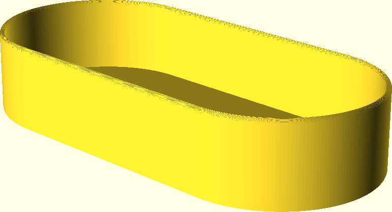

# ocular-protection-cover

A parametric protection-cover for a microscope ocular. The current setup is for our fineplacer-183.

It has the possibility to have rounded edges. This is achieved with the fillets3d-library, which uses loads of CPU time for the generation of the fillets..

